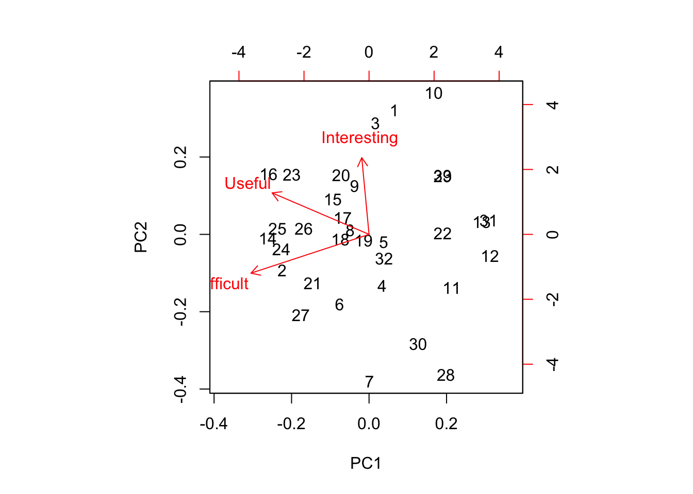
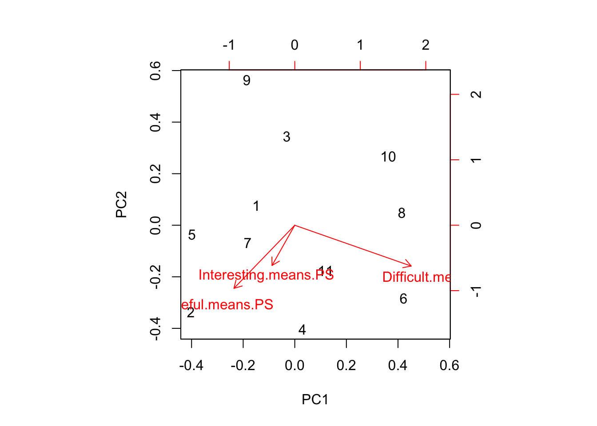

Week 14 Lab
=============

In lab we'll go through 

1. Some practice with PCA using the semester survey results

2. Some practice with GLMs using the semester survey results

There are a number of functions you could use in R to do principal components analysis. We will use the 'prcomp' function, but there is a very closely related function called 'princomp' as well as a function called 'principal' which is in the 'psych' package.


```r
readings<-read.csv("~/Dropbox/Biometry/Week 14 Multivariate analyses and Review/Week 14 Lab/Readings 2017.csv",header=T)

missing<-which(is.na(readings$Useful)|is.na(readings$Difficult)|is.na(readings$Interesting))
Useful<-aggregate(readings$Useful[-missing], by=list(Index=readings$Index[-missing]),FUN=mean)$x

Difficult<-aggregate(readings$Difficult[-missing], by=list(Index=readings$Index[-missing]),FUN=mean)$x

Interesting<-aggregate(readings$Interesting[-missing], by=list(Index=readings$Index[-missing]),FUN=mean)$x

Length.means.readings<-aggregate(readings$Length[-missing], by=list(Index=readings$Index[-missing]),FUN=mean)$x

pca.result<-prcomp(~Useful+Interesting+Difficult,retx=T)
```

Before printing out the result, let's make sure everyone understands what I was doing with the aggregate commands, and how the 'prcomp' function input works. 

To print out a summary of the PCA, we use


```r
summary(pca.result)
```

```
## Importance of components:
##                           PC1    PC2    PC3
## Standard deviation     0.7541 0.6334 0.3761
## Proportion of Variance 0.5117 0.3610 0.1273
## Cumulative Proportion  0.5117 0.8727 1.0000
```

We see that PCA1 is associated with over 50% of the variation in responses. So, what is PCA1?


```r
pca.result$rotation
```

```
##                    PC1        PC2        PC3
## Useful      -0.6036460 -0.2726190 -0.7491932
## Interesting -0.2924971 -0.7984601  0.5262195
## Difficult   -0.7416583  0.5367871  0.4022470
```

PCA1 is an axis which describes papers that are Not Useful and Not Difficult, with a lesser weight towards papers that are Not Interesting. In other words, a large positive PCA1 score would be associated with an Easy paper that was neither Interesting nor Useful. Note that the principal components denote an axis, but the direction is arbitrary. Since no direction is implied by the sign, we do not interpret this as saying that most papers were Not Useful, Not Difficult, and Not Useful. Instead we would say that the papers largely fall along a common axis in which Easy/Boring/Useless papers are at one end, and Difficult/Interesting/Useful papers are at the other end. (Obviously, the goal is to weed out the former in favor of the latter over time.)

We can visualize this using the function 'biplot'


```r
biplot(pca.result)
```



Biplots take some getting used to, and when they have many more dimensions, they become increasingly difficult to interpret. However, papers high on PC1 are generally Easy/Boring/Useless and papers high on PC2 are generally Difficult and Boring. 

So which papers came out as highly negative on the PC1 axis? Remember, these are the most "Useful" and "Difficult"?


```r
readings[readings$Index==9,1][1]
```

```
## [1] Burnham et al. (2011) AIC model selection and multimodel inference in behavioral ecology: some background, observations, and comparisons. Behavior, Ecology, and Sociobiology 65: 23-35.
## 35 Levels: Altman, N., and M. Krzywinski. 2015. Split plot design. Nature Methods 12(3): 165-166. ...
```

```r
readings[readings$Index==17,1][1]
```

```
## [1] Hulbert, S. H. 1984. Pseudoreplication and the design of ecological field experiments. Ecological Monographs 54(2): 187-211.
## 35 Levels: Altman, N., and M. Krzywinski. 2015. Split plot design. Nature Methods 12(3): 165-166. ...
```

```r
readings[readings$Index==31,1][1]
```

```
## [1] Shmueli (2010) To explain or predict? Statistical Science 25(3): 289-310.
## 35 Levels: Altman, N., and M. Krzywinski. 2015. Split plot design. Nature Methods 12(3): 165-166. ...
```

You can play around with this yourself and see why I added the [1] at the end. When I pull out the rows with the Index identified by the PCA, I get the list of all entries (since we had >1 team rating the papers) and so I only print the first one.

Which papers were highly negative on PC2? (Not Difficult but Interesting)


```r
readings[readings$Index==14,1][1]
```

```
## [1] Gelman, A. 2011. Open data and open methods. Chance 24(4): 51-53.
## 35 Levels: Altman, N., and M. Krzywinski. 2015. Split plot design. Nature Methods 12(3): 165-166. ...
```

```r
readings[readings$Index==32,1][1]
```

```
## [1] Siddhartha, R. D., E. B. Fowlkes, and B. Hoadley. 1989. Risk analysis of the space shuttle: Pre-challenger prediction of failure. Journal of the American Statistical Association 84(408): 945-957.
## 35 Levels: Altman, N., and M. Krzywinski. 2015. Split plot design. Nature Methods 12(3): 165-166. ...
```

There is one paper in the lower right quadrant (Interesting and Easy but not that Useful).


```r
readings[readings$Index==14,1][1]
```

```
## [1] Gelman, A. 2011. Open data and open methods. Chance 24(4): 51-53.
## 35 Levels: Altman, N., and M. Krzywinski. 2015. Split plot design. Nature Methods 12(3): 165-166. ...
```


We can do the same for the problem sets:


```r
PS<-read.csv("~/Dropbox/Biometry/Week 14 Multivariate analyses and Review/Week 14 Lab/ProblemSets 2017.csv",header=T)

# In this case there were no missing data
Useful.means.PS<-aggregate(PS$Useful, by=list(Index=PS$Week),FUN=mean)$x

Difficult.means.PS<-aggregate(PS$Difficult, by=list(Week=PS$Week),FUN=mean)$x

Interesting.means.PS<-aggregate(PS$Interesting, by=list(Week=PS$Week),FUN=mean)$x

pca.result<-prcomp(~Useful.means.PS+Interesting.means.PS+Difficult.means.PS,data=PS,retx=T)
```

Notice that it has simply labeled them in order, so 7=Week #9 PS, 8=Week #10 PS, 9=Week #11 PS, 10=Week #12 PS, and 11=Week #13 PS.

To print out a summary of the PCA, we use


```r
summary(pca.result)
```

```
## Importance of components:
##                           PC1    PC2     PC3
## Standard deviation     0.7783 0.3553 0.28044
## Proportion of Variance 0.7472 0.1557 0.09703
## Cumulative Proportion  0.7472 0.9030 1.00000
```

We see that for the problem sets, PC1 is slightly more dominant (75% of the variation). So, what is PCA1?


```r
pca.result$rotation
```

```
##                              PC1       PC2        PC3
## Useful.means.PS      -0.03149178 0.6091803 -0.7924062
## Interesting.means.PS -0.35568719 0.7340708  0.5784693
## Difficult.means.PS    0.93407435 0.3000658  0.1935604
```

PC1 is almost entirely dominated by "Difficult". A large positive PC1 score indicates a problem set that was difficult. PC2 is more evenly divided between "Useful" and "Interesting" so positive PC2 values indicate "Useful" and "Interesting" and "Difficult". (Reminder: the signs of the PCs is arbitrary, so R could have given us this same information flipped on its axis, and made positive PC2 values associated with "Not Useful" and "Boring" and "Easy".) Its a little hard to say in this case which quadrat we "want", but if "Useful" is the most important metric, than we want problem sets that are as far as possible in the upper section of the biplot.


```r
biplot(pca.result)
```



Problem set 7 (Week #9) is at the bottom, but at least it is not very far along that axis! Suggestions on all the problem sets most welcome. (Over the years, this exercise has eliminated the worst performing problem sets, so these are now much more highly clustered than they were several years ago.)

Missing at random - practice with GLMs
--------------------------------------

Many of the surveys had missing data for some of the readings. One could ask the question, are these data missing at random? In the problem set for Week #13, we completed the dataset using random imputation. In other words, we assumed that data were missing at random and we drew with replacement from the other values to replace missing datapoints. However, in this case, it seems likely that data are not missing at random. I suspect that papers were not evaluated because no one read them, and that something about the papers may predict whether the papers were read or not. We can answer this question by constructing a model for "missingness" which assumes that the probability of being evaluated is distributed as Binom(n,p) where p is the probability of being evaluated (and presumably, of having been read in the first place).

First, I need to go through the data and figure out how many times a paper was evaluated. 

```r
num.missing<-vector(length=max(readings$Index))
for (i in 1:max(readings$Index))
{
  num.missing.useful<-sum(as.numeric(is.na(readings$Useful[readings$Index==i])))
  num.missing.difficult<-sum(as.numeric(is.na(readings$Difficult[readings$Index==i])))
  num.missing.interesting<-sum(as.numeric(is.na(readings$Interesting[readings$Index==i])))
  max.missing<-max(num.missing.useful,num.missing.difficult,num.missing.interesting)
  num.missing[i]<-max.missing
}
```

For simplicity, I am considering "evaluated" as evaluated for all three categories (Useful, Difficult, and Interesting).

Now I use a Binomial GLM to model the probability of being evaluated as a function of Useful, Interesting, and Difficult (as rated by the other groups). Note that there were 5 groups total, so n=5.


```r
fit<-glm(cbind(5-num.missing,num.missing)~Useful+Difficult+Interesting,family="binomial")
summary(fit)
```

```
## 
## Call:
## glm(formula = cbind(5 - num.missing, num.missing) ~ Useful + 
##     Difficult + Interesting, family = "binomial")
## 
## Deviance Residuals: 
##     Min       1Q   Median       3Q      Max  
## -2.2891  -0.8304   0.6778   1.2893   2.6728  
## 
## Coefficients:
##             Estimate Std. Error z value Pr(>|z|)   
## (Intercept) -0.06796    1.52324  -0.045  0.96441   
## Useful       1.13443    0.40286   2.816  0.00486 **
## Difficult   -0.19064    0.31791  -0.600  0.54873   
## Interesting -0.68611    0.39094  -1.755  0.07925 . 
## ---
## Signif. codes:  0 '***' 0.001 '**' 0.01 '*' 0.05 '.' 0.1 ' ' 1
## 
## (Dispersion parameter for binomial family taken to be 1)
## 
##     Null deviance: 68.034  on 34  degrees of freedom
## Residual deviance: 58.825  on 31  degrees of freedom
## AIC: 103.38
## 
## Number of Fisher Scoring iterations: 4
```

Notice that Useful is the only predictor statistically significant to $\alpha$=0.05, but "Interesting" also has a marginally significant p-values. The "Useful" result accords with expectations - papers that are more "Useful" are more likely to be read, but the non-significant (and possibly not "real") Interesting result is counterintuitive, in that the model says less Interesting papers are actually more likely to be read.

We might suspect a high degree of multicollinearity among the predictors. We can use PCA to create new orthogonal covariates which (more efficiently) capture the variability in the survey results. 

I will rerun the PCA for the readings.


```r
pca.result<-prcomp(~Useful+Interesting+Difficult,retx=T)
summary(pca.result)
```

```
## Importance of components:
##                           PC1    PC2    PC3
## Standard deviation     0.7541 0.6334 0.3761
## Proportion of Variance 0.5117 0.3610 0.1273
## Cumulative Proportion  0.5117 0.8727 1.0000
```

```r
pca.result$rotation
```

```
##                    PC1        PC2        PC3
## Useful      -0.6036460 -0.2726190 -0.7491932
## Interesting -0.2924971 -0.7984601  0.5262195
## Difficult   -0.7416583  0.5367871  0.4022470
```

PCA1 captures about 50% of the variability, so we try using just PCA in our GLM. 


```r
fit<-glm(cbind(5-num.missing,num.missing)~pca.result$x[,1],family="binomial")
summary(fit)
```

```
## 
## Call:
## glm(formula = cbind(5 - num.missing, num.missing) ~ pca.result$x[, 
##     1], family = "binomial")
## 
## Deviance Residuals: 
##     Min       1Q   Median       3Q      Max  
## -2.2493  -1.1675   0.3243   1.4856   1.7659  
## 
## Coefficients:
##                   Estimate Std. Error z value Pr(>|z|)    
## (Intercept)         1.3395     0.1888   7.095 1.29e-12 ***
## pca.result$x[, 1]  -0.3833     0.2515  -1.524    0.128    
## ---
## Signif. codes:  0 '***' 0.001 '**' 0.01 '*' 0.05 '.' 0.1 ' ' 1
## 
## (Dispersion parameter for binomial family taken to be 1)
## 
##     Null deviance: 68.034  on 34  degrees of freedom
## Residual deviance: 65.679  on 33  degrees of freedom
## AIC: 106.23
## 
## Number of Fisher Scoring iterations: 4
```

This is really interesting. The first PC actually is less significant than Difficult alone. The reason for this is that in terms of variation among the readings, there is a degree of collinearity between Difficult and Useful (not much, r=0.41) but the probability of reading (at least, providing a rating for) a paper is predicted by Difficult independent of Useful (and so the combination of the two in the PCA actually is less significant in the model). Can we explain the results by looking at the length of the paper?


```r
fit<-glm(cbind(5-num.missing,num.missing)~Length.means.readings,family="binomial")
summary(fit)
```

```
## 
## Call:
## glm(formula = cbind(5 - num.missing, num.missing) ~ Length.means.readings, 
##     family = "binomial")
## 
## Deviance Residuals: 
##     Min       1Q   Median       3Q      Max  
## -1.9652  -1.0056   0.2514   1.5838   1.6858  
## 
## Coefficients:
##                       Estimate Std. Error z value Pr(>|z|)    
## (Intercept)            1.05579    0.29209   3.615 0.000301 ***
## Length.means.readings  0.02844    0.02647   1.074 0.282647    
## ---
## Signif. codes:  0 '***' 0.001 '**' 0.01 '*' 0.05 '.' 0.1 ' ' 1
## 
## (Dispersion parameter for binomial family taken to be 1)
## 
##     Null deviance: 68.034  on 34  degrees of freedom
## Residual deviance: 66.535  on 33  degrees of freedom
## AIC: 107.08
## 
## Number of Fisher Scoring iterations: 4
```

Surprisingly, length is not statistically correlated with whether a paper was read.
